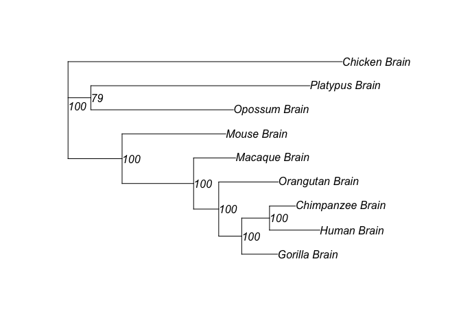

# TreeExp

Version 2.0 includes a new ancestral expression estimation function and a few of bug fixes

*TreeExp* is an *R* package that performs analyses of expression
evolution from *RNA-seq* data, including optimized input formatting,
normalization and pair-wise distance evaluation, expression character
tree inference, preliminary phylogenetic network analysis, gene-specific 
expression conservation evaluation and ancestral expression estimation.

*TreeExp* package is under active developing, current stable version 2.0
is available at <https://github.com/hr1912/TreeExp>.

A convenient way to install package from github is through *devtools*
package:

    install.packages('devtools')
    devtools::install_github("hr1912/TreeExp")

Users can also download *TreeExp* package and install locally through:

    install.packages("filePath/TreeExp.2.0.tar.gz", repos = NUll, type = "source")

Load the package in the usual way:

    library('TreeExp')

    ## Loading required package: ape

    ## Loading required package: phytools

    ## Loading required package: maps

    ## 
    ##  # maps v3.1: updated 'world': all lakes moved to separate new #
    ##  # 'lakes' database. Type '?world' or 'news(package="maps")'.  #

Expression divergence of two genomes can be considered as concerted
evolution of transcriptome from their common ancestor, which can be
measured by among orthologous genes' variance components. And more
specifically, the expression levels of same tissue across different
species can be treated as taxonomic units, which can be placed at the
tips of character tree that represents expression evolution of these
species.

In here, we will give an example to build a character tree from
expression data (expression phylogeny).

### Input Format:

*TreeExp* package takes in reads count data and gene information file in
certain format:

1.  Gene information file should be a text file in the shape of a
    matrix, in which values are separated by tabs. `Rows` correspond to
    orthologous genes and `columns` correspond to species names. And the
    values in the matrix are in the format of "`GeneId:GeneLength`".

2.  Reads count file should also be a text file in the matrix shape,
    `Rows` correspond to orthologous genes which should be in one-to-one
    correspondence with rows in Gene information file, though gene ids
    are displayed in reads count file. `Columns` correspond to
    sample names. Sample names are in format of
    "`TaxaName_SubtaxaName_ReplicatesName`".

The example files are included in the TreeExp package, which can be
found in `extdata` folder in the package. One can load them in to take a
look:

    readsCount.table = read.table(system.file('extdata/tetraexp.read.counts.raw.txt', 
                                                package='TreeExp'), header = T)
    head(readsCount.table[,1:10])

    ##   homoSapienGeneId Human_Brain_Female Human_Brain_Male1 Human_Brain_Male2
    ## 1  ENSG00000198824              16323             11147             19507
    ## 2  ENSG00000118402              31883             19242             32321
    ## 3  ENSG00000166167             102711             80104            141338
    ## 4  ENSG00000144724              51020             37861             43906
    ## 5  ENSG00000183508                988              1443               760
    ## 6  ENSG00000008086              27839             10208             20666
    ##   Human_Brain_Male3 Human_Brain_Male4 Human_Brain_Male5
    ## 1              4402              6521               683
    ## 2              9841              1164              1362
    ## 3             59947             23104             14613
    ## 4             24645              3968              5653
    ## 5               456               227               456
    ## 6             12970              2569              1940
    ##   Human_Cerebellum_Female Human_Cerebellum_Male Human_Heart_Female
    ## 1                   20032                 43008               3381
    ## 2                   26732                 57081                228
    ## 3                   56103                105866              17022
    ## 4                   26365                 66177              41876
    ## 5                     988                  1215              16913
    ## 6                    4987                 11862                878

    geneInfo.table = read.table(system.file('extdata/tetraexp.length.ortholog.txt',
                                            package='TreeExp'), header = T)
    head(geneInfo.table)

    ##                  Human              Chimpanzee                  Bonobo
    ## 1 ENSG00000198824:3788 ENSPTRG00000023033:3786 ENSPTRG00000023033:3786
    ## 2 ENSG00000118402:3042 ENSPTRG00000018370:2962 ENSPTRG00000018370:2962
    ## 3 ENSG00000166167:6255 ENSPTRG00000002869:6153 ENSPTRG00000002869:6153
    ## 4 ENSG00000144724:9524 ENSPTRG00000015067:6726 ENSPTRG00000015067:6726
    ## 5 ENSG00000183508:5751 ENSPTRG00000001166:5717 ENSPTRG00000001166:5717
    ## 6 ENSG00000008086:3576 ENSPTRG00000021711:2874 ENSPTRG00000021711:2874
    ##                   Gorilla               Orangutan                 Macaque
    ## 1 ENSGGOG00000009918:3808 ENSPPYG00000005537:2442 ENSMMUG00000023599:3781
    ## 2 ENSGGOG00000009359:2890  ENSPPYG00000016794:945 ENSMMUG00000020208:2960
    ## 3 ENSGGOG00000005023:5882 ENSPPYG00000002583:6130 ENSMMUG00000006741:6001
    ## 4 ENSGGOG00000006858:6049 ENSPPYG00000013752:4933 ENSMMUG00000012487:5949
    ## 5 ENSGGOG00000004149:5727 ENSPPYG00000000972:1987 ENSMMUG00000004907:3522
    ## 6 ENSGGOG00000010796:3354 ENSPPYG00000020166:3024 ENSMMUG00000005063:3077
    ##                     Mouse                 Opossum                Platypus
    ## 1 ENSMUSG00000047710:4040 ENSMODG00000003128:2568 ENSOANG00000000610:2487
    ## 2 ENSMUSG00000032262:2146  ENSMODG00000018420:945  ENSOANG00000001290:909
    ## 3 ENSMUSG00000025217:2984 ENSMODG00000011788:1888 ENSOANG00000007316:1936
    ## 4 ENSMUSG00000021745:9375 ENSMODG00000002722:4448 ENSOANG00000006011:3968
    ## 5 ENSMUSG00000044468:5640 ENSMODG00000023227:1194 ENSOANG00000003065:1335
    ## 6 ENSMUSG00000031292:3484 ENSMODG00000017140:2589 ENSOANG00000004037:2607
    ##                   Chicken
    ## 1 ENSGALG00000016813:2412
    ## 2 ENSGALG00000015876:1322
    ## 3 ENSGALG00000007820:1962
    ## 4 ENSGALG00000007177:5396
    ## 5 ENSGALG00000014453:1179
    ## 6 ENSGALG00000016529:2712

### Construction:

The construction function `TEconstruct` loads in the reads count data
file as well as a gene information file, and wraps them in a list of
*taxonExp* objects (one *taxaExp* object).

In the package, we include files transformed from six tissues'
expression reads count data of nine tetrapod species. If you want to
transform your own data, a transformation Perl script
`format2treeexp.pl` to format raw outputs of *TopHat2* to "*TreeExp*
compatible" is available at `tools` folder in the package. Or you can
access the script at
<https://github.com/hr1912/TreeExp/blob/master/tools/format2treeexp.pl>

    taxa.objects = TEconstruct(readCountsFP = system.file('extdata/tetraexp.read.counts.raw.txt', package='TreeExp'),
      geneInfoFP = system.file('extdata/tetraexp.length.ortholog.txt', package='TreeExp'), 
      taxa = "all", subtaxa = c("Brain", "Cerebellum"), normalize = "TPM")

The construction process takes **several minutes** on a desktop computer
depending on data size and hardware performance. Specify **"taxa"** and
**"subtaxa"** options in the function when using partial of your data.
The construction process will be faster. If you are hesitated to test
the *TreeExp*, the package has already bundled a constructed object and
you can load the object through:

    data(tetraexp)

You can take a look at what the loaded objects:

    print(tetraexp.objects, details = TRUE)

    ## 
    ##  59 taxonExp objects 
    ## 
    ## object 1 : Human      Brain 
    ## object 2 : Human      Cerebellum 
    ## object 3 : Human      Heart 
    ## object 4 : Human      Kidney 
    ## object 5 : Human      Liver 
    ## object 6 : Human      Testis 
    ## object 7 : Chimpanzee     Brain 
    ## object 8 : Chimpanzee     Cerebellum 
    ## object 9 : Chimpanzee     Heart 
    ## object 10 : Chimpanzee    Kidney 
    ## object 11 : Chimpanzee    Liver 
    ## object 12 : Chimpanzee    Testis 
    ## object 13 : Bonobo    Brain 
    ## object 14 : Bonobo    Cerebellum 
    ## object 15 : Bonobo    Heart 
    ## object 16 : Bonobo    Kidney 
    ## object 17 : Bonobo    Liver 
    ## object 18 : Bonobo    Testis 
    ## object 19 : Gorilla   Brain 
    ## object 20 : Gorilla   Cerebellum 
    ## object 21 : Gorilla   Heart 
    ## object 22 : Gorilla   Kidney 
    ## object 23 : Gorilla   Liver 
    ## object 24 : Gorilla   Testis 
    ## object 25 : Orangutan     Brain 
    ## object 26 : Orangutan     Cerebellum 
    ## object 27 : Orangutan     Heart 
    ## object 28 : Orangutan     Kidney 
    ## object 29 : Orangutan     Liver 
    ## object 30 : Macaque   Brain 
    ## object 31 : Macaque   Cerebellum 
    ## object 32 : Macaque   Heart 
    ## object 33 : Macaque   Kidney 
    ## object 34 : Macaque   Liver 
    ## object 35 : Macaque   Testis 
    ## object 36 : Mouse     Brain 
    ## object 37 : Mouse     Cerebellum 
    ## object 38 : Mouse     Heart 
    ## object 39 : Mouse     Kidney 
    ## object 40 : Mouse     Liver 
    ## object 41 : Mouse     Testis 
    ## object 42 : Opossum   Brain 
    ## object 43 : Opossum   Cerebellum 
    ## object 44 : Opossum   Heart 
    ## object 45 : Opossum   Kidney 
    ## object 46 : Opossum   Liver 
    ## object 47 : Opossum   Testis 
    ## object 48 : Platypus      Brain 
    ## object 49 : Platypus      Cerebellum 
    ## object 50 : Platypus      Heart 
    ## object 51 : Platypus      Kidney 
    ## object 52 : Platypus      Liver 
    ## object 53 : Platypus      Testis 
    ## object 54 : Chicken   Brain 
    ## object 55 : Chicken   Cerebellum 
    ## object 56 : Chicken   Heart 
    ## object 57 : Chicken   Kidney 
    ## object 58 : Chicken   Liver 
    ## object 59 : Chicken   Testis

    print(tetraexp.objects[[1]], printlen = 6)

    ## 
    ## One taxonExp object
    ## Taxon name:  Human 
    ## Subtaxon name:  Brain 
    ## Total gene number:  5636 
    ## Total bio replicates number:  6 
    ## Bio replicates titles:
    ## [1] "Female" "Male1"  "Male2"  "Male3"  "Male4"  "Male5" 
    ## Outliers NOT removed
    ## Normalized expression value calculated
    ## Normalized method:  TPM 
    ## Over-dispersion parameter omega NOT calculated

    head(tetraexp.objects[[1]]$normExp.val)

    ##                 Human_Brain_Female Human_Brain_Male1 Human_Brain_Male2
    ## ENSG00000198824          28.181700         22.882260          32.29216
    ## ENSG00000118402          68.545215         49.186043          66.62576
    ## ENSG00000166167         107.390735         99.581296         141.69295
    ## ENSG00000144724          35.034687         30.911749          28.90820
    ## ENSG00000183508           1.123546          1.951074           0.82868
    ## ENSG00000008086          50.913540         22.196988          36.23894
    ##                 Human_Brain_Male3 Human_Brain_Male4 Human_Brain_Male5
    ## ENSG00000198824        11.2300374        23.9962144          7.981515
    ## ENSG00000118402        31.2623165         5.3337453         19.819491
    ## ENSG00000166167        92.6149878        51.4870922        103.415744
    ## ENSG00000144724        25.0063652         5.8075209         26.274483
    ## ENSG00000183508         0.7662361         0.5502005          3.509911
    ## ENSG00000008086        35.0496431        10.0139426         24.014791

### Distance matrix:

Let us quickly jump to the issue of creating phylogeny from *taxaExp*
object. First, we generate a distance matrix:

    dismat <- expdist(tetraexp.objects, taxa = "all",
                     subtaxa = "Brain",
                     method = "pea")
    as.dist(dismat)

    ##                  Human_Brain Chimpanzee_Brain Bonobo_Brain Gorilla_Brain
    ## Chimpanzee_Brain  0.03928547                                            
    ## Bonobo_Brain      0.05396989       0.02661905                           
    ## Gorilla_Brain     0.04541838       0.04346133   0.05570732              
    ## Orangutan_Brain   0.07441185       0.06650002   0.07418112    0.06650577
    ## Macaque_Brain     0.07096816       0.07026106   0.07568838    0.07142640
    ## Mouse_Brain       0.14753659       0.14734369   0.14570042    0.15773811
    ## Opossum_Brain     0.21460036       0.21023433   0.20623812    0.22218695
    ## Platypus_Brain    0.25206865       0.24840352   0.24224782    0.26264144
    ## Chicken_Brain     0.27145998       0.27435377   0.26609183    0.27168518
    ##                  Orangutan_Brain Macaque_Brain Mouse_Brain Opossum_Brain
    ## Chimpanzee_Brain                                                        
    ## Bonobo_Brain                                                            
    ## Gorilla_Brain                                                           
    ## Orangutan_Brain                                                         
    ## Macaque_Brain         0.07718557                                        
    ## Mouse_Brain           0.15908033    0.12541961                          
    ## Opossum_Brain         0.22389360    0.19697327  0.17580708              
    ## Platypus_Brain        0.26309704    0.23960607  0.22327274    0.20305429
    ## Chicken_Brain         0.26891715    0.24476163  0.23916411    0.28310650
    ##                  Platypus_Brain
    ## Chimpanzee_Brain               
    ## Bonobo_Brain                   
    ## Gorilla_Brain                  
    ## Orangutan_Brain                
    ## Macaque_Brain                  
    ## Mouse_Brain                    
    ## Opossum_Brain                  
    ## Platypus_Brain                 
    ## Chicken_Brain        0.28657845

You can specify **"taxa"** and **"subtaxa"** options in the `expdist`
function as well. The default model **"pea"** is to calculate pair-wise
distances by Pearson distance, which equals 1-Pearson’s coefficient of
expression level.

### Expression character tree:

After distance matrix is created, you can construct character tree by
Neighbor-Joining, and bootstrap values can also be generated by
`boot.phylo` function:

    tr <- NJ(dismat)
    tr <- root(tr, "Chicken_Brain", resolve.root = T)

    exptable <- exptabTE(tetraexp.objects, taxa = "all",
                         subtaxa = "Brain")

    f <- function(xx) {
        
         mat <- dist.pea(t(xx))
        
        colnames(mat) <- rownames(xx)
        rownames(mat) <- colnames(mat)
        
        root(NJ(mat), "Chicken_Brain", resolve.root = T)
        
    }

    bs <-  boot.phylo(tr, t(exptable), f, B = 100)

    tr$node.label = bs
    plot(tr, show.node.label = TRUE)

By now, an expression tree is successfully constructed. The tree shows
expression patterns' similarities in selected genes of designated
species. The expression tree is largely in accordance with species tree
with minor discrepancy.

Phenomenon of evolutionary history dominates the evolutionary expression
pattern can be described as phylogenetic signals. One way to interpret
highly consistent expression character tree is that expression levels of
transcriptome, representing the regulatory changes, accumulated over
time. Though not as concrete as sequence data, expression levels
generated from transcriptome data across species show strong
phylogenetic signals.
