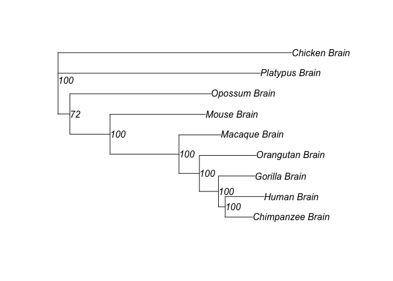

phyExp
======

*phyExp* is an *R* package that performs expression phylogenetic
analysis from *RNA-seq* count data, including optimized input
formatting, normalization and pair-wise distance evaluation, preliminary
phylogenetic network analysis.

*phyExp* package is under active developing, version 0.1 is availiable
at <https://github.com/hr1912/phyExp>.

A convenient way to install package from github is through *devtools*
package:

    install.packages(devtools)
    devtools::install_github("hr1912/phyExp")

Load the package in the usual way:

    library(phyExp)

The construction function `TEconstruct` loads in the reads count data
file as well as a gene infomation file (gene lengths and ortholog), and
wraps them in a list of *taxonExp* objects (one *taxaExp* object).

In the package, we include files tranformed from six tissues' expression
reads count data of nine tetrapod species. If you want to transform your
own data, a tranformation Perl script to format raw outputs of *TopHat2*
to "*phyExp* compatible" is availiable at
<https://github.com/hr1912/phyExp/blob/master/tools/format2phyexp.pl>

    taxa.objects = TEconstruct(readsCountFP = system.file('extdata/tetraexp.reads.count.raw.txt', package='phyExp'),
      geneInfoFP = system.file('extdata/tetraexp.gene.length.ortholog.txt', package='phyExp'), 
      taxa = "all", subtaxa = c("Brain", "Cerebellum"), calRPKM=TRUE, rmOut=TRUE)

The construction process takes **several minutes** on a desktop computer
depanding on data size and hardware performance. Specify **"taxa"** and
**"subtaxa"** options in the function when using partial of your data.
The construction process will be faster. If you are hesitated to test
the package, the construnction process is already done by us and you can
load the objects like:

    data(tetraexp)

You can take a look at what the loaded objects:

    print(tetraexp.objects, details = TRUE)

    ## 
    ##  53 taxonExp objects 
    ## 
    ## object 1 : Human      Brain 
    ## object 2 : Human      Cerebellum 
    ## object 3 : Human      Heart 
    ## object 4 : Human      Kidney 
    ## object 5 : Human      Liver 
    ## object 6 : Human      Testis 
    ## object 7 : Chimpanzee     Brain 
    ## object 8 : Chimpanzee     Cerebellum 
    ## object 9 : Chimpanzee     Heart 
    ## object 10 : Chimpanzee    Kidney 
    ## object 11 : Chimpanzee    Liver 
    ## object 12 : Chimpanzee    Testis 
    ## object 13 : Gorilla   Brain 
    ## object 14 : Gorilla   Cerebellum 
    ## object 15 : Gorilla   Heart 
    ## object 16 : Gorilla   Kidney 
    ## object 17 : Gorilla   Liver 
    ## object 18 : Gorilla   Testis 
    ## object 19 : Orangutan     Brain 
    ## object 20 : Orangutan     Cerebellum 
    ## object 21 : Orangutan     Heart 
    ## object 22 : Orangutan     Kidney 
    ## object 23 : Orangutan     Liver 
    ## object 24 : Macaque   Brain 
    ## object 25 : Macaque   Cerebellum 
    ## object 26 : Macaque   Heart 
    ## object 27 : Macaque   Kidney 
    ## object 28 : Macaque   Liver 
    ## object 29 : Macaque   Testis 
    ## object 30 : Mouse     Brain 
    ## object 31 : Mouse     Cerebellum 
    ## object 32 : Mouse     Heart 
    ## object 33 : Mouse     Kidney 
    ## object 34 : Mouse     Liver 
    ## object 35 : Mouse     Testis 
    ## object 36 : Opossum   Brain 
    ## object 37 : Opossum   Cerebellum 
    ## object 38 : Opossum   Heart 
    ## object 39 : Opossum   Kidney 
    ## object 40 : Opossum   Liver 
    ## object 41 : Opossum   Testis 
    ## object 42 : Platypus      Brain 
    ## object 43 : Platypus      Cerebellum 
    ## object 44 : Platypus      Heart 
    ## object 45 : Platypus      Kidney 
    ## object 46 : Platypus      Liver 
    ## object 47 : Platypus      Testis 
    ## object 48 : Chicken   Brain 
    ## object 49 : Chicken   Cerebellum 
    ## object 50 : Chicken   Heart 
    ## object 51 : Chicken   Kidney 
    ## object 52 : Chicken   Liver 
    ## object 53 : Chicken   Testis

    print(tetraexp.objects[[1]], printlen = 6)

    ## 
    ## One taxonExp object
    ## Taxon name:  Human 
    ## Subtaxon name:  Brain 
    ## Total gene number:  5636 
    ## Total bio replicates number:  6 
    ## Bio replicates titles:
    ## [1] "Female" "Male1"  "Male2"  "Male3"  "Male4"  "Male5" 
    ## Outliers removed
    ## RPKM calculated
    ## Over-dispersion parameter omega NOT calculated

    head(tetraexp.objects[[1]]$rpkm.rmOut)

    ##                 Human_Brain_Female Human_Brain_Male1 Human_Brain_Male2
    ## ENSG00000198824          3.9537403          2.700015         4.7249655
    ## ENSG00000118402          9.6165234          5.803756         9.7486326
    ## ENSG00000166167         15.0663402         11.750193        20.7324083
    ## ENSG00000144724          4.9151773          3.647462         4.2298271
    ## ENSG00000183508          0.1576274          0.230219         0.1212518
    ## ENSG00000008086          7.1428947          2.619155         5.3024556
    ##                 Human_Brain_Male3 Human_Brain_Male4 Human_Brain_Male5
    ## ENSG00000198824        1.06624791        1.57950991        0.16543556
    ## ENSG00000118402        2.96823408        0.35108469        0.41080529
    ## ENSG00000166167        8.79342907        3.38905008        2.14353310
    ## ENSG00000144724        2.37425609        0.38227016        0.54460011
    ## ENSG00000183508        0.07275111        0.03621601        0.07275111
    ## ENSG00000008086        3.32782585        0.65915070        0.49776269

Let us quickly jump to the issue of creating phylogeny from *taxaExp*
object. First, we generate a distance matrix:

    dismat <- expdist(tetraexp.objects, taxa = "all",
                     subtaxa = "Brain",
                     method = "rho")
    dismat

    ##                  Human_Brain Chimpanzee_Brain Gorilla_Brain
    ## Human_Brain       0.00000000       0.00000000    0.00000000
    ## Chimpanzee_Brain  0.04299175       0.00000000    0.00000000
    ## Gorilla_Brain     0.05224428       0.04660633    0.00000000
    ## Orangutan_Brain   0.08376988       0.06876732    0.07018497
    ## Macaque_Brain     0.08029099       0.07682204    0.07541596
    ## Mouse_Brain       0.15691053       0.15483405    0.16320232
    ## Opossum_Brain     0.21240509       0.20824912    0.21791233
    ## Platypus_Brain    0.25725097       0.25148061    0.26093140
    ## Chicken_Brain     0.28506616       0.28434146    0.28162655
    ##                  Orangutan_Brain Macaque_Brain Mouse_Brain Opossum_Brain
    ## Human_Brain           0.00000000     0.0000000   0.0000000     0.0000000
    ## Chimpanzee_Brain      0.00000000     0.0000000   0.0000000     0.0000000
    ## Gorilla_Brain         0.00000000     0.0000000   0.0000000     0.0000000
    ## Orangutan_Brain       0.00000000     0.0000000   0.0000000     0.0000000
    ## Macaque_Brain         0.07818084     0.0000000   0.0000000     0.0000000
    ## Mouse_Brain           0.15767528     0.1300113   0.0000000     0.0000000
    ## Opossum_Brain         0.21041113     0.1944756   0.1762546     0.0000000
    ## Platypus_Brain        0.25710013     0.2478675   0.2414205     0.2194949
    ## Chicken_Brain         0.27482848     0.2510857   0.2391266     0.2617681
    ##                  Platypus_Brain Chicken_Brain
    ## Human_Brain            0.000000             0
    ## Chimpanzee_Brain       0.000000             0
    ## Gorilla_Brain          0.000000             0
    ## Orangutan_Brain        0.000000             0
    ## Macaque_Brain          0.000000             0
    ## Mouse_Brain            0.000000             0
    ## Opossum_Brain          0.000000             0
    ## Platypus_Brain         0.000000             0
    ## Chicken_Brain          0.282923             0

You can specify **"taxa"** and **"subtaxa"** options in the `expdist`
function as well. The default model **"rho"** is to calculate pair-wise
distances by "1-rho", which "rho" refers to Spearman’s coefficient of
expression level.

After distance matrix is created, you can construct phylogeny by
Neighbor-Joining, and you can also generate bootstrap values by
`boot.exphy` function:

    library(ape)
    tr <- nj(dismat)
    tr <- root(tr, "Chicken_Brain")
    bs <- boot.exphy(tr, tetraexp.objects, method = "rho",
                     B = 100, rooted = "Chicken_Brain")
    tr$node.label = bs
    plot(tr, show.node.label = TRUE)

